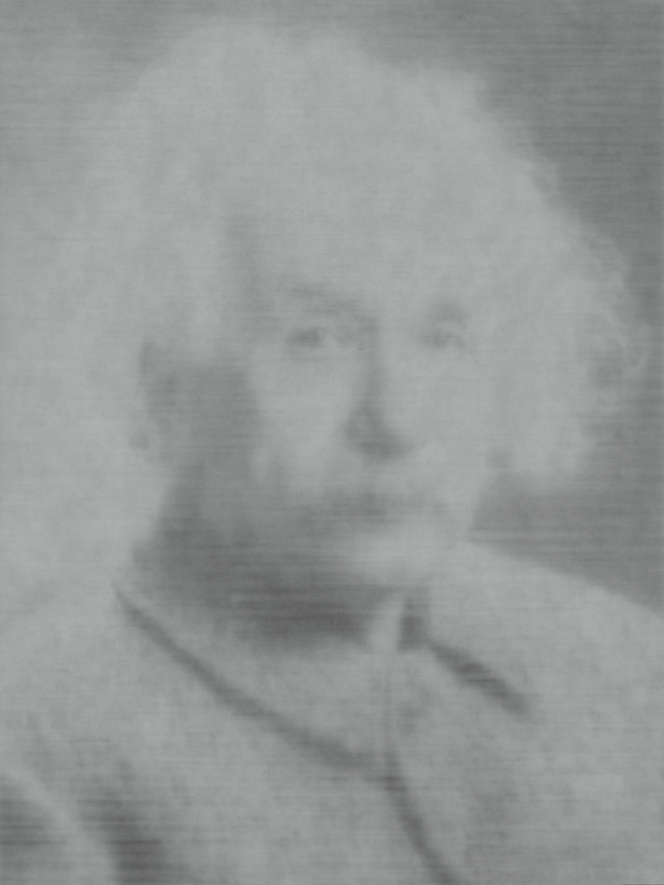

# Metal Hash-MLP
A somewhat messy re-implementation of the "learning a 2D image" example from Thomas Müller's awesome [tiny-cuda-nn](https://github.com/NVlabs/tiny-cuda-nn) in Metal.

| 10 steps | 100 steps | 1000 steps | Reference image |
|:---:|:---:|:---:|:---:|
|  |  |  |  |

## Performance

### M3 Max
A single training iteration takes roughly `3ms` on M3 Max (compared to `1ms` with `tiny-cuda-nn` on an RTX 4090).
That's not too shabby using only a tenth of the power ;-)

The M3 performs much better than M1 for the scattered memory accesses caused by the hashgrid, likely so due to its more sophisticated caching.

### M1 Max
Performance on M1 Max can be okayish (`5ms`), but requires a crude hack: Replace the `atomic_fetch_add_explicit` in the hashgrid backpropagation with a non-atomic `+=`, which despite the undefined behavior is surprisingly robust in practice.
Without this hack, performance on M1 Max is quite poor (`33ms`, roughly 10 times slower), almost all of which (`30ms`) can be attributed slow hashgrid backprop (which extensively uses atomic float scatter to device memory).
With this hack, hashgrid backprop only takes `1.8ms`, which is surprisingly still slower than M3 Max with correct atomic behavior (`1.2ms`).
